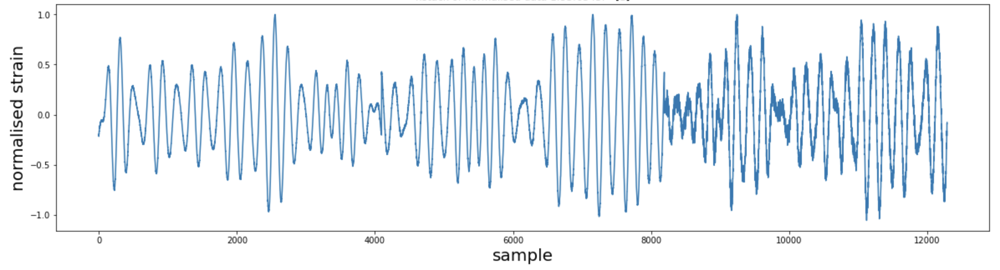
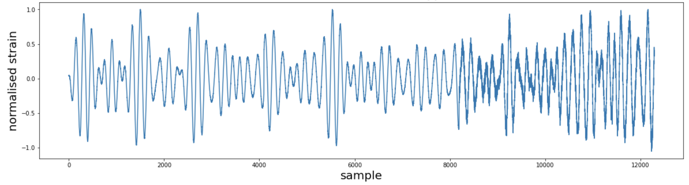

# Gravitational_Wave_Detection
Used supervised machine learning to detect the presence of a signal from time series data containing simulated gravitational wave measurements from a network of 3 gravitational wave interferometers (LIGO Hanford, LIGO Livingston, and Virgo).

The project was completed as part of a course project for the course CS235: Data Mining Techniques in Fall 2021.
The dataset was part of a kaggle competition https://www.kaggle.com/c/g2net-gravitational-wave-detection. Each data sample consists of 3 time series of interval 2 seconds sampled at 2048 Hz and hence was stored as [3 X 4096] array. 

A sample with signal present (labeled y = 1) 

comapred to a sample with label y = 0 (only background noise)

shows that no signs of signal jumps out of the naked eye.
